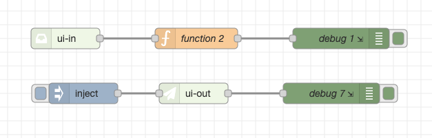
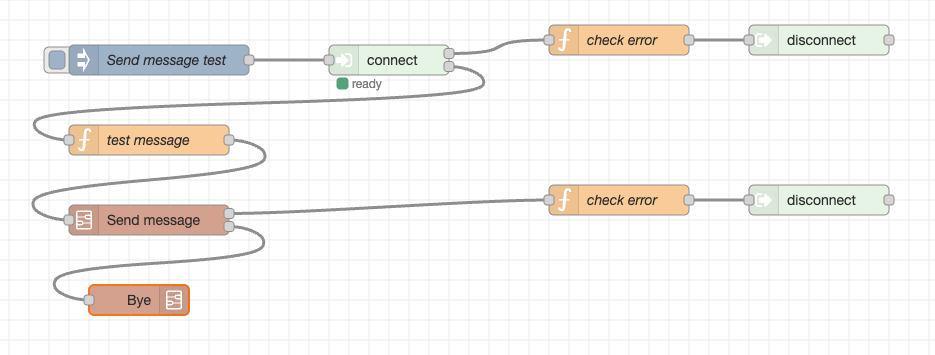
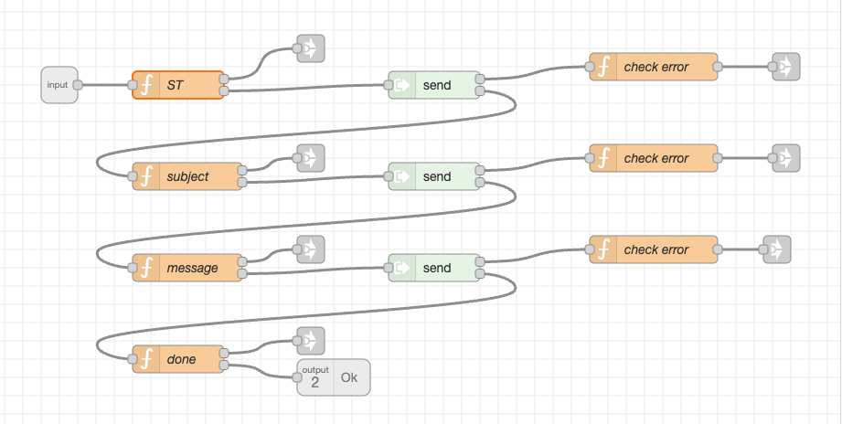
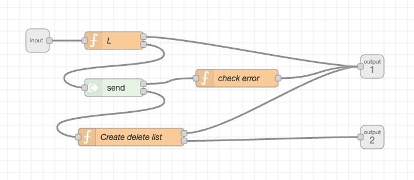
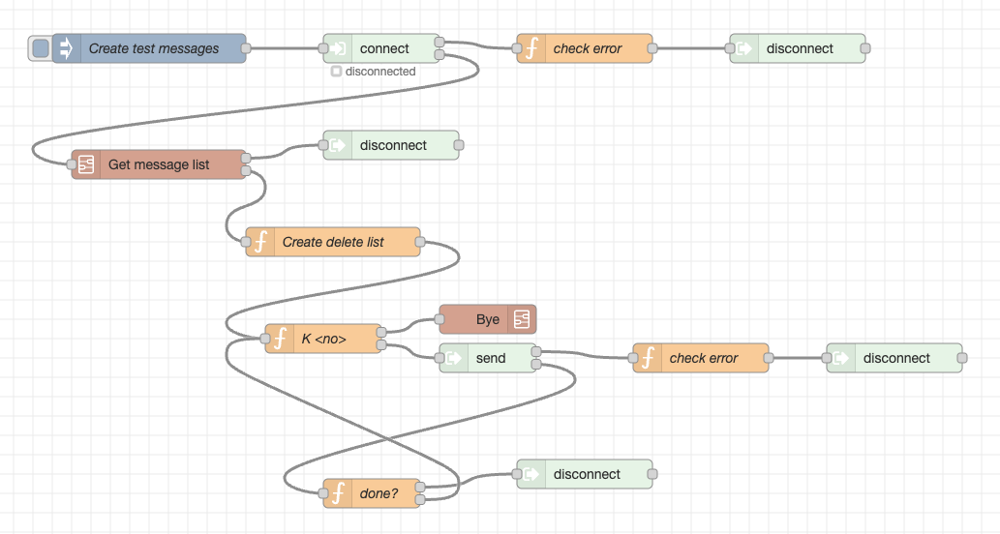
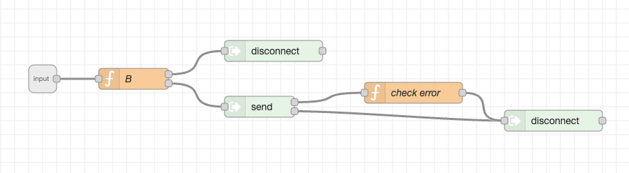

# node-red-contrib-ax25

Node-RED nodes for AX.25 packet radio connectivity via an AGWPE (AGW Packet Engine) server. Configure a connection to a local or remote AGWPE instance and use the provided nodes to establish connected sessions, exchange unconnected UI frames, monitor traffic, and encode/decode raw AX.25 frames — all from Node-RED flows without writing socket code.

## Use cases

### Connected mode — BBS and remote stations

Use the `connect` and `send` nodes to establish an AX.25 connected session to a remote station such as a bulletin board system (BBS). The `connect` node sends the AX.25 connection request and emits lifecycle events and received data as the session progresses. Chain `send` nodes after it to exchange data: each `send` takes over the data output for the session so it receives the response to its own transmission. Use `waitFor` patterns to synchronize with BBS prompts without writing polling loops.

```
[inject connect] → [connect] → output 1: lifecycle events (connected / disconnected / timeout)
                             → output 2: received data
                                  ↓
[inject "send payload"] → [send] → output 2: response to this sent payload
                                ↓
[inject] → [disconnect] → output 1: disconnecting event
           (disconnected fires on [connect] output 1 when TNC confirms)
```

### APRS — UI frame monitoring and transmission

APRS uses AX.25 UI (unconnected) frames. Enable raw mode on the `agwpe-client` config node and use `ui-in` to receive decoded APRS packets (source, destination, via path, payload) and `ui-out` to transmit UI frames. 

Use `ui-in` and `ui-out` to quickly prototype/develop APRS services or gateways.  

---

## Installation

```bash
npm install node-red-contrib-ax25
```

Restart Node-RED. The nodes appear in the **agwpe** category in the palette.

---

## Nodes

### agwpe-client (config node)

Configure the AGWPE server connection in the Node-RED editor. The connection is established automatically when the flow deploys.

Any software that exposes the AGWPE TCP interface works as a backend, including:

- **[Direwolf](https://github.com/wb2osz/direwolf)** — software TNC for sound cards; widely used for APRS and packet radio on Linux, macOS, and Windows.
- **[Soundmodem](https://uz7.ho.ua/packetradio.htm)** — UZ7HO's sound card TNC with AGWPE server support.
- **[esp-tnc](https://github.com/n7get/esp-tnc)** — AX.25 router and BBS for ESP microcontrollers with AGWPE TCP server support.
- **[go-ax25](https://github.com/n7get/go-ax25)** — Go library for AX.25.

**Editor fields:**

| Field | Default | Description |
|-------|---------|-------------|
| Host | `127.0.0.1` | AGWPE server hostname or IP |
| Port | `8000` | AGWPE server TCP port |
| Callsigns | — | Comma-separated callsigns to register with AGWPE on connect |
| Username / Password | — | Optional AGWPE credentials |
| Monitor Mode | off | Enable monitor frame delivery to `monitor-in` nodes |
| Raw Mode | off | Enable raw frame delivery to `raw-in` nodes and `ui-in` / `ui-out` |
| Auto-Reconnect | on | Automatically reconnect after a dropped connection |
| Reconnect Delay | `5000` ms | Delay before each reconnect attempt |

The `connect`, `ui-out`, `ui-in`, `monitor-in`, `raw-out`, and `raw-in` nodes each select which `agwpe-client` to bind to using a **Client** dropdown in their editor. The `send` node does not need a client selection — it gets the `agwpe-client` from the `sessionId`. The `agwpe-control` node also selects an `agwpe-client` via its **Client** dropdown and sends control commands to it at runtime.

---

### agwpe-control

Sends runtime control commands to an `agwpe-client` config node from a Node-RED flow.

**Input:** set `msg.command` to one of the supported commands.

| `msg.command` | Description | Additional `msg` fields |
|---|---|---|
| `"disconnect"` | Disconnect all active sessions and close the AGWPE connection (no auto-reconnect) | — |
| `"connect"` | Connect to the AGWPE server using the current configuration | — |
| `"set-config"` | Update one or more runtime configuration fields | `msg.host`, `msg.port`, `msg.callsigns`, `msg.username`, `msg.password` |
| `"get-config"` | Retrieve the current configuration | — |
| `"get-status"` | Retrieve the current runtime status | — |

**Output:**

All responses include `msg.status` (`"ok"` or `"error"`) and `msg.command`.

- `get-config` and `set-config` include `msg.config` (`host`, `port`, `callsigns`, `username`, `state`).
- `get-status` includes `msg.payload` (`state`, `monitorEnabled`, `rawEnabled`, `sessions`).
- `disconnect` includes `msg.event: "disconnected"`.
- `connect` includes `msg.event: "connecting"`.
- Errors include `msg.errorCode` (`CLIENT_NOT_FOUND` or `UNKNOWN_COMMAND`) and `msg.errorText`.

> **Note:** `set-config` updates runtime state only — changes are not persisted to the Node-RED flow definition. Use `connect` after `set-config` to apply a new host/port.

---

### connect

Establishes an AX.25 connected session to a remote station.

**Input:** any message with `msg.destination` set (or configured in the node editor).

```json
{ "destination": "N0CALL-1" }
```

`source` defaults to the first callsign registered on the `agwpe-client`. `destination` can also be set in the node editor and overridden per-message. `via` accepts a comma-separated string, array of strings, or array of `{ callsign, hasBeenRepeated }` objects.

```json
{ "source": "N0CALL", "destination": "N0CALL-1", "via": "RELAY" }
```

**Output 1 — lifecycle events** (`msg.event`):

| Event | Meaning |
|-------|---------|
| `connecting` | Connect request sent |
| `connected` | Remote station accepted |
| `disconnecting` | Disconnect in progress |
| `disconnected` | Session closed |
| `timeout` | No activity (sent or received) within timeout period |
| `failed` | Transport or session error |

**Output 2 — received data:**

Controlled by the **Mode** editor field (default: `line`):

- **line mode** — incoming bytes are buffered and split on CR or CR+LF. Each complete line is emitted as `msg.payload` (string). If `waitFor` is set (a regex string), lines accumulate until one matches; `msg.payload` is then an array of the preceding lines and `msg.match` is the matching line. On timeout, `msg.event: "timeout"` is emitted on output 1 with the current buffer contents.
- **binary mode** — each received frame is emitted immediately with `msg.payload` as a Buffer.

`mode`, `waitFor`, `timeout`, `source`, `destination`, and `via` can all be set in the node editor and overridden per-message with the corresponding `msg` properties.

The `sessionId` assigned to the session is included on every output message and must be passed to subsequent `send` commands.

---

### send

Sends data on an established session. When a `send` node processes an input message, it takes over the data output (output 2) for that session so it receives the response to its own transmission.

The `send` node gets the correct `agwpe-client` at runtime from the `sessionId`, so it works with any session from any client automatically.

**Input:**

```json
{ "sessionId": "sess-abc", "payload": "HELLO\r" }
```

`payload` may be a string or a Buffer. Arrays of strings/Buffers are also accepted; each item is sent as a separate frame. Payloads longer than 255 bytes are segmented automatically.

**Output 1** — lifecycle events (same structure as `connect` output 1).  
**Output 2** — received data (same line/binary behaviour as `connect`; `waitFor` and `timeout` can be set in the node editor or per-message).

---

### disconnect

Initiates a graceful disconnect for an established session. 

**Input:** any message with `msg.sessionId` set.

```json
{ "sessionId": "sess-abc" }
```

**Output 1** — emits `disconnecting` immediately on success, or `SESSION_NOT_FOUND` on error. The `disconnected` event fires on the originating `connect` node's output 1 once the TNC confirms with a `d` frame.

---

### ui-out

Encodes and transmits an AX.25 UI frame via the AGWPE raw (K-frame) transport. **Raw mode must be enabled** on the `agwpe-client`.

Set `source`, `destination`, `via`, and `payload` in the node editor. Any triggering message causes the frame to be sent; individual fields can be overridden per-message:

```json
{ "payload": "status text" }
```

`via` accepts the same formats as `connect`. `msg.agwpePort` overrides the AGWPE port byte (default `0`).

Output: a single message with `event: "ui-sent"` on success, or an error envelope on failure.

---

### ui-in

Receives AGWPE raw (K-frame) traffic, decodes the embedded AX.25 UI frames, and emits one message per frame. **Raw mode must be enabled** on the `agwpe-client`.

Output message fields: `source`, `destination`, `via` (array of callsigns), `payload`.

The **Payload Output** editor option selects `string` (UTF-8, default) or `buffer` (raw bytes).

Non-UI frames are silently discarded.

---

### monitor-in

Receives all frames seen by the AGWPE server in monitor mode. **Monitor mode must be enabled** on the `agwpe-client`.

Output: one message per frame with `source`, `destination`, `payload`, and AGWPE frame metadata.

---

### raw-out

Transmits a raw AX.25 frame inside an AGWPE K-frame. **Raw mode must be enabled.**

`msg.payload` accepts:

- `Buffer`
- `Uint8Array`
- byte array (numbers 0–255)
- hex string (`"82 a0 a8"` or `"82a0a8"`)

`msg.agwpePort` (or the editor **AGWPE Port** field, default `0`) sets the leading port byte of the K-frame.

---

### raw-in

Receives raw AGWPE K-frames. **Raw mode must be enabled.**

Output: `msg.payload` is a Buffer of the raw AX.25 wire bytes (leading AGWPE port byte stripped and exposed separately as `msg.agwpePort`).

---

### decode

Decodes a raw AX.25 frame Buffer into its constituent fields.

**Input:** `msg.payload` must be a Buffer containing AX.25 wire bytes (e.g. from `raw-in`).

**Output:**

```json
{
  "source": "N0CALL",
  "destination": "CQ",
  "via": [{ "callsign": "WIDE1-1", "hasBeenRepeated": false }],
  "control": 3,
  "pid": 240,
  "payload": "decoded payload here"
}
```

The **Payload Output** editor option selects `string` (UTF-8, default) or `buffer`.

---

### encode

Encodes structured fields into a raw AX.25 frame Buffer. Editor defaults are pre-set for a UI frame (control `0x03`, PID `0xF0`). All fields can be overridden per-message.

**Input fields** (message overrides editor defaults):

| Field | Example | Notes |
|-------|---------|-------|
| `source` | `"N0CALL"` | |
| `destination` | `"CQ"` | |
| `via` | `"WIDE1-1,WIDE2-1"` | string, array of strings, or array of `{callsign, hasBeenRepeated}` |
| `control` | `3` | byte value, or use `frameType` (`"U"`, `"I"`, `"S"`) |
| `pid` | `240` | byte value |
| `payload` | `"text"` | string or Buffer |

**Output:** `msg.payload` is the encoded AX.25 frame as a Buffer, ready to pass to `raw-out`.

---

## Examples

Ready-to-import flows are provided in the [`examples/`](examples/) directory. Import any `.json` file via **Menu → Import** in the Node-RED editor.

---

### Beacons

**File:** [`examples/beacons.json`](examples/beacons.json)



Receives and transmits AX.25 UI frames using the `ui-in` and `ui-out` nodes. Demonstrates APRS-style beacon monitoring and periodic transmission.

---

### Send message test

**File:** [`examples/send_test_message.json`](examples/send_test_message.json)



A complete flow that connects to a packet BBS, composes and sends a test message using the **Send message** subflow, and disconnects via the **Bye** subflow. Demonstrates end-to-end message delivery from connection through graceful teardown.

---

### Send message subflow

**File:** [`examples/send_message_subflow.json`](examples/send_message_subflow.json)



A reusable subflow that composes and sends a message to a packet BBS: sets the addressee, subject, and body via a sequence of `send` nodes, each waiting for the BBS prompt before advancing.

---

### Get message list subflow

**File:** [`examples/get_message_list_subflow.json`](examples/get_message_list_subflow.json)



A reusable subflow that retrieves the message list from a packet BBS using the `send` / `waitFor` pattern and returns a parsed list.

---

### Delete all my messages

**File:** [`examples/delete_all_my_messages.json`](examples/delete_all_my_messages.json)



A full flow that connects to a packet BBS, retrieves the message list using the **Get message list** subflow, deletes every message addressed to the registered callsign, and disconnects cleanly. Demonstrates composing subflows into a complete automated task.

---

### Bye subflow

**File:** [`examples/bye_subflow.json`](examples/bye_subflow.json)



A reusable subflow that sends a `BYE` command and waits for the BBS to close the session gracefully. Intended to be composed into larger BBS flows.

---

## Testing

```bash
npm test
```
## TODO

Implement `listen` and `accept` nodes for creating AX.25 servers.

